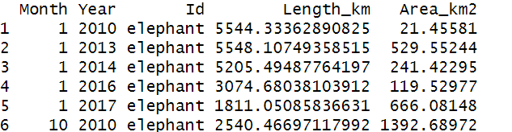
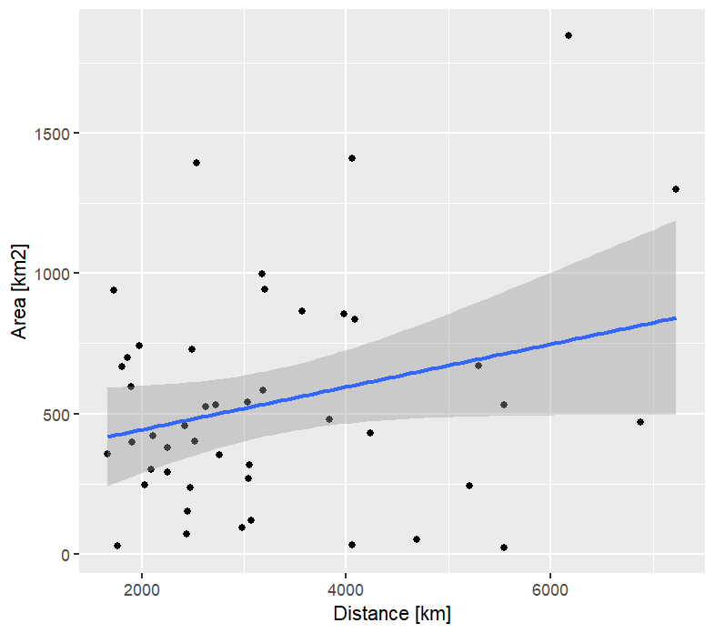
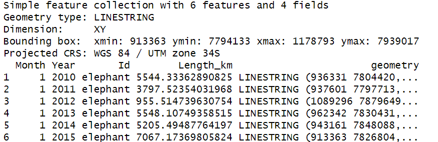
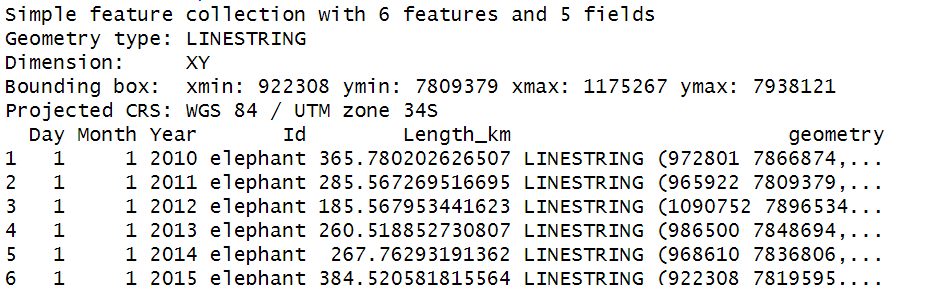

Home range utilization and traveled distance over time
================

- [homdista package](#homdista-package)
  - [Installation](#installation)
  - [homdista functions](#homdista-functions)
  - [Arguments](#arguments)
  - [Example](#example)
  - [References](#references)

<!-- README.md is generated from README.Rmd. Please edit that file -->

# homdista package

<!-- badges: start -->
<!-- badges: end -->

The homdista package is designed to analyze the movement patterns of
objects, like animals, using recorded GPS coordinates. This toolkit
offers various functions to compute home range areas and distances
traveled over extended periods, daily, monthly and yearly. To determine
home range, the package employs a kernel density estimator, requiring
users to specify the bandwidth themselves. For distance estimation, the
package utilizes the st_distance function to link all points in
chronological order based on their timestamps.

## Installation

You can install the homdista package from [GitHub](https://github.com/)
with:

``` r
# install.packages("devtools")
devtools::install_github("2023Jado/homdista")
```

## homdista functions

    # Computes monthly and yearly utilized areas and distances walked
    homdista(file, tf, crs_epsg, Id_name, perc, parh)

    # Generates polygons representing the utilized areas
    homekde(file, tf, crs_epsg, Id_name, perc, parh)

    # Calculates correlation values and visualizes the relationship between area and distance
    hodicor(adista, cormethod)

    # Creates line paths to visualize the traveled distances
    distwalk(file, tf, crs_epsg, Id_name)

    # Converts a data frame into a move object for more detailed movement analysis
    moveObject(file, tf, Id_name, crs_epsg)

## Arguments

    file          R-imported dataframe which comprises at least three columns: a longitude column labeled "x", 
                  a latitude column labeled "y", and a timestamp column labeled "timestamp", in lowercase.

    tf            Timestamp format.

    crs_epsg      EPSG code related to the dataset coordinates.

    Id_name       Column name from dataset which shows different categories (e.g., different groups (group A, 
                  group B, group C, ...)).

    perc          The percentage utilized to calculate the KDE home range at a specific level (e.g., 50% for 
                  core areas, 75%, 90%, 95%, ...).
                  
    parh          Bandwidth or smoothing parameter.

    adista        A layer containing the area and distances values generated from the homdista function.

    cormethod     Correlation method between paired samples (pearson", "kendall", or "spearman") at 
                  confidence level of 95%.

## Example

The following are basic examples for how each of the functions works:

1.  Home range estimation and walked distance calculation

<!-- -->

    library(homdista)

    ## Read the file
    file <- read.csv("data.csv", header = T)

    ## Home range area (with Kernel density estimator) and walked distance calculation
    area_distance <- homdista(file ,"%m/%d/%y %I:%M %p", 32734, "Animal", 90, 500)
    head(area_distance)



2.  Generating spatial polygons for the home range areas

<!-- -->

    library(homdista)
    #Additional libraries
    library(sf)
    library(mapview)

    ## Generates polygons representing the utilized areas
    homerange <- homekde(file ,"%m/%d/%y %I:%M %p", 32734, "Animal", 90, 500)

    # Convert "sp" object to "sf"
    Homerange <- st_as_sf(homerange)

    # Define a palette for colors
    palette <- rainbow(length(unique(Homerange$Id)))

    #Create map with mapview
    mapview(Homerange, zcol = "Id", col.regions = palette, legend = TRUE, legend.title = "", legend.values = unique(Homerange$Id))


3.  Get correlation values and plot the relationship between area and
    distance values

<!-- -->

    library(homdista)

    ## Home range area (with Kernel density estimator) and walked distance calculation
    area_distance <- homdista(file ,"%m/%d/%y %I:%M %p", 32734, "Animal", 90, 500)

    ## Correlation values and plot the relationship between area and distance values using spearman method
    Correlation <- hodicor(area_distance, "spearman")



    Correlation


4.  Get the line paths to visualize the traveled distances

<!-- -->

    library(homdista)

    #Additional library
    library(mapview)

    Distance <- distwalk(file, "%m/%d/%y %I:%M %p", 32734, "Animal")

    head(Distance)
    mapview(Distance, zcol = "Id", col.regions = rainbow(length(unique(Distance$Id))), legend = TRUE, legend.title = " ", legend.values = unique(Distance$Id)))




5.  Daily traveled distance

<!-- -->

    library(homdista)
    Daily_distance <- daytraj(file, "%m/%d/%y %I:%M %p", 32734, "Animal")
    head(Daily_distance)



6.  Converts a data frame into a move object for more detailed movement
    analysis

<!-- -->

    library(homdista)

    #Additional libraries
    library(sf)
    library(mapview)

    Move <- moveObject(file, "%m/%d/%y %I:%M %p", "Animal", 32734)

    mapview(Move)


## References

    1. Fleming, C. H., & Calabrese, J. M. (2017). A new kernel density estimator for accurate home‐range and species‐range area estimation. Methods in Ecology and Evolution, 8(5), 571-579.

    2. Calenge, C. (2011). Home range estimation in R: the adehabitatHR package. Office national de la classe et de la faune sauvage: Saint Benoist, Auffargis, France.

    3. Wu, X., Roy, U., Hamidi, M., & Craig, B. N. (2020). Estimate travel time of ships in narrow channel based on AIS data. Ocean Engineering, 202, 106790.

    4. Pebesma, E. J. (2018). Simple features for R: standardized support for spatial vector data. R J., 10(1), 439.

    5. Urbano, F., Basille, M., & Racine, P. (2014). From Points to Habitat: Relating Environmental Information to GPS Positions. Spatial Database for GPS Wildlife Tracking Data: A Practical Guide to Creating a Data Management System with PostgreSQL/PostGIS and R, 75-93.
